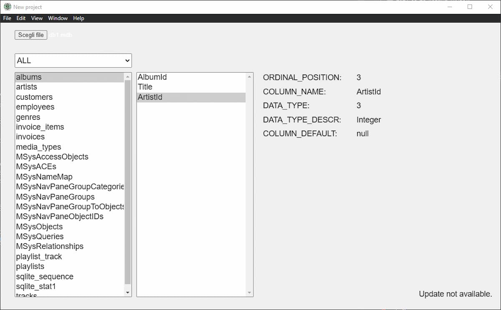

# Access C3
_Read MS Access files_

This is a feasibility test for a larger project

Readme: [Free post (Patreon)](https://www.patreon.com/posts/ms-access-3-50472226)




### How to use

Electron must be installed

```
npm install -g electron-installer-windows
```
https://github.com/electron-userland/electron-installer-windows#readme


For other operating systems, see the official repository.
https://github.com/electron-userland

Run

```
npm install
```

Then run

```
npm run start
```

